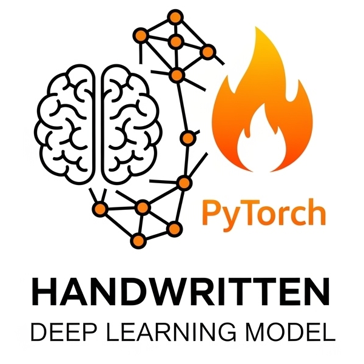

# PyTorch 训练

<div align="center">
  
</div>

> 这是一个用于学习和实践 PyTorch 深度学习框架的个人项目仓库。本仓库将逐步实现和训练各种深度学习模型，并最终融入 Hugging Face Transformers 的学习与应用。

> 本项目在较难理解的代码处，均配有 Google Gemini Canvas 详细解析文档，便于深入理解核心实现与原理。你可以在相关代码文件的注释中找到对应的 Gemini Canvas 链接。

---

## 📑 目录

- [PyTorch 训练](#pytorch-训练)
  - [📑 目录](#-目录)
  - [🚀 项目目标](#-项目目标)
  - [📦 项目结构](#-项目结构)
  - [✨ 模型列表](#-模型列表)
    - [1. VGG (2014)](#1-vgg-2014)
    - [2. ResNet (2015)](#2-resnet-2015)
    - [3. Fast R-CNN (2015)](#3-fast-r-cnn-2015)
    - [4. Faster R-CNN (2015)](#4-faster-r-cnn-2015)
    - [5. Transformer (2017)](#5-transformer-2017)
    - [6. Mask R-CNN (2017)](#6-mask-r-cnn-2017)
    - [7. ViT (2020)](#7-vit-2020)
    - [8. DETR (2020)](#8-detr-2020)
    - [9. Deformable DETR (2020)](#9-deformable-detr-2020)
    - [10. CLIP (2021)](#10-clip-2021)
    - [11. ViLT (2021)](#11-vilt-2021)
    - [12. Mask2Former (2021)](#12-mask2former-2021)
    - [13. SAM (2023)](#13-sam-2023)
  - [📚 学习计划 (未来)](#-学习计划-未来)
  - [🛠️ 环境配置](#️-环境配置)
  - [💡 使用指南 (示例)](#-使用指南-示例)
    - [模型训练](#模型训练)
    - [模型评估](#模型评估)
    - [模型推理](#模型推理)
  - [🤝 贡献](#-贡献)
  - [📄 许可证](#-许可证)
  - [📞 联系我](#-联系我)

---

## 🚀 项目目标

<div class="goals">

- **深入理解** PyTorch 框架的核心概念和 API。
- **手写实现并训练** 经典的深度学习模型。
- **掌握** 常见计算机视觉和自然语言处理任务。
- **探索并应用** Hugging Face Transformers 库进行前沿模型实践。
- **构建一个可复用** 的模型训练与评估流程。

</div>

---

## 📦 项目结构

```
PyTorch/
├── data/...
├── models/
│   ├── VGG/...
│   ├── Transformer/...
│   ├── CLIP/...
│   ├── ViT/...
│   ├── ViLT/...
│   ├── DETR/...
│   └── Deformable_DETR/...
├── TEST/
│   ├── test_AutoTokenizer.py
│   ├── test_dataset.py
│   ├── test_GPU.py
│   └── ...
│
├── .gitignore
├── README.md
├── LICENSE
└── requirements.txt
```

[⬆️ 返回顶部](#pytorch-训练)

---

## ✨ 模型列表

<table>
  <tr>
    <th>模型</th>
    <th>状态</th>
    <th>年份</th>
    <th>主要功能</th>
    <th>数据集</th>
  </tr>
  <tr>
    <td><strong>1. VGG</strong></td>
    <td>✅ 已完成</td>
    <td>2014</td>
    <td>图像分类</td>
    <td>CIFAR-10, CIFAR-100</td>
  </tr>
  <tr>
    <td><strong>2. ResNet</strong></td>
    <td>🚧 计划中</td>
    <td>2015</td>
    <td>图像分类</td>
    <td>待定(ImageNet, CIFAR-10)</td>
  </tr>
  <tr>
    <td><strong>3. Fast R-CNN</strong></td>
    <td>🚧 计划中</td>
    <td>2015</td>
    <td>目标检测</td>
    <td>待定(PASCAL VOC)</td>
  </tr>
  <tr>
    <td><strong>4. Faster R-CNN</strong></td>
    <td>🚧 计划中</td>
    <td>2015</td>
    <td>目标检测</td>
    <td>待定(PASCAL VOC, COCO)</td>
  </tr>
  <tr>
    <td><strong>5. Transformer</strong></td>
    <td>✅ 已完成</td>
    <td>2017</td>
    <td>机器翻译</td>
    <td>Multi30k</td>
  </tr>
  <tr>
    <td><strong>6. Mask R-CNN</strong></td>
    <td>🚧 计划中</td>
    <td>2017</td>
    <td>实例分割</td>
    <td>待定(COCO)</td>
  </tr>
  <tr>
    <td><strong>7. ViT</strong></td>
    <td>🚧 计划中</td>
    <td>2020</td>
    <td>图像分类</td>
    <td>待定</td>
  </tr>
  <tr>
    <td><strong>8. DETR</strong></td>
    <td>⚙️ 进行中</td>
    <td>2020</td>
    <td>端到端目标检测</td>
    <td>待定</td>
  </tr>
  <tr>
    <td><strong>9. Deformable DETR</strong></td>
    <td>🚧 计划中</td>
    <td>2020</td>
    <td>改进的端到端目标检测</td>
    <td>待定</td>
  </tr>
  <tr>
    <td><strong>10. CLIP</strong></td>
    <td>✅ 已完成</td>
    <td>2021</td>
    <td>跨模态图像-文本理解</td>
    <td>Flickr30k</td>
  </tr>
  <tr>
    <td><strong>11. ViLT</strong></td>
    <td>🚧 计划中</td>
    <td>2021</td>
    <td>视觉-语言多模态任务</td>
    <td>待定</td>
  </tr>
  <tr>
    <td><strong>12. Mask2Former</strong></td>
    <td>🚧 计划中</td>
    <td>2021</td>
    <td>统一的图像分割</td>
    <td>待定(COCO, ADE20K, Cityscapes)</td>
  </tr>
  <tr>
    <td><strong>13. SAM</strong></td>
    <td>🚧 计划中</td>
    <td>2023</td>
    <td>通用图像分割</td>
    <td>待定(SA-1B)</td>
  </tr>
</table>

### 1. VGG (2014) {#1-vgg-2014}

<details>
<summary>查看详情</summary>

- **实现状态:** ✅ 已完成
- **发表时间:** 2014 年 9 月
- **主要功能:** 图像分类
- **数据集:** CIFAR-10, CIFAR-100
- **简要说明:** VGG 通过反复堆叠极小的 3x3 卷积核与 2x2 池化层，成功地构建了深达 16 或 19 层的统一网络结构。该模型有力地证明了增加网络深度是提升图像识别性能的关键，为后续更深模型的架构设计(如 ResNet)奠定了重要基础。
- **完成功能:**
  - 实现了 VGG-11,13,16,19 网络架构
  - 支持 CIFAR-10 数据集的训练和评估
  - 实现了数据增强和预处理流程
  - 提供了模型训练、验证和测试的完整流程
  </details>

### 2. ResNet (2015) {#2-resnet-2015}

<details>
<summary>查看详情</summary>

- **实现状态:** 🚧 计划中
- **发表时间:** 2015 年 12 月
- **主要功能:** 图像分类
- **数据集:** 待定(ImageNet, CIFAR-10)
- **简要说明:** ResNet(残差网络)通过其创新的"快捷连接"(skip connection)结构，允许信息和梯度直接跨越多层传播，从而解决了超深度网络中常见的性能退化和梯度消失问题。这一设计使得训练上百甚至上千层的神经网络成为可能，是计算机视觉领域一个里程碑式的突破。
- **当前进度:** 正在设计模型架构。
</details>

### 3. Fast R-CNN (2015) {#3-fast-r-cnn-2015}

<details>
<summary>查看详情</summary>

- **实现状态:** 🚧 计划中
- **发表时间:** 2015 年 4 月
- **主要功能:** 目标检测
- **数据集:** 待定(PASCAL VOC)
- **简要说明:** Fast R-CNN 通过共享卷积计算和 RoI 池化层的创新设计，显著提升了 R-CNN 的检测速度和准确率。该模型首次实现了端到端的检测器训练，将特征提取、目标分类和边界框回归统一到单一网络中，为后续目标检测模型奠定了重要基础。
- **当前进度:** 暂无
</details>

### 4. Faster R-CNN (2015) {#4-faster-r-cnn-2015}

<details>
<summary>查看详情</summary>

- **实现状态:** 🚧 计划中
- **发表时间:** 2015 年 6 月
- **主要功能:** 目标检测
- **数据集:** 待定(PASCAL VOC, COCO)
- **简要说明:** Faster R-CNN 提出了革命性的区域提议网络(Region Proposal Network, RPN)，首次将候选区域的生成也整合进深度网络中，实现了全端到端的目标检测系统。这一架构不仅大幅提升了检测速度，还显著改善了检测精度，成为后续众多检测和分割模型的基础框架。
- **当前进度:** 暂无
</details>

### 5. Transformer (2017) {#5-transformer-2017}

<details>
<summary>查看详情</summary>

- **实现状态:** ✅ 已完成
- **发表时间:** 2017 年 12 月
- **主要功能:** 机器翻译
- **数据集:** Multi30k
- **简要说明:** Transformer 模型通过其创新的"自注意力机制"(Self-Attention)，完全摒弃了传统的循环和卷积结构，允许模型在处理序列时同时关注所有位置并直接计算它们之间的全局依赖关系，实现了高效的并行计算，是自然语言处理(NLP)领域一个革命性里程碑。
- **完成功能:**
  - 实现了完整的 Transformer 编码器-解码器架构
  - 实现了多头自注意力机制和正弦位置编码
  - 支持 Multi30k 数据集的训练和评估
  - 实现了基于贪婪解码策略的自回归输出
  </details>

### 6. Mask R-CNN (2017) {#6-mask-r-cnn-2017}

<details>
<summary>查看详情</summary>

- **实现状态:** 🚧 计划中
- **发表时间:** 2017 年 3 月
- **主要功能:** 实例分割
- **数据集:** 待定(COCO)
- **简要说明:** Mask R-CNN 在经典物体检测框架 Faster R-CNN 的基础上，通过巧妙地增加一个与边界框回归并行的掩码(Mask)预测分支，从而将物体检测和实例分割(Instance Segmentation)这两个任务高效地统一到了一个框架中。该模型引入了 RoIAlign 技术来解决像素对齐问题，实现了对每个物体在像素级别上的精确分割。
- **当前进度:** 暂无。
</details>

### 7. ViT (2020) {#7-vit-2020}

<details>
<summary>查看详情</summary>

- **实现状态:** 🚧 计划中
- **发表时间:** 2020 年 10 月
- **主要功能:** 图像分类
- **数据集:** 待定
- **简要说明:** ViT 将 Transformer 架构应用于图像识别领域，其将图像划分为一系列固定大小的图像块(Patches)，并将这些块的线性嵌入序列输入给 Transformer 编码器进行处理。经过大规模数据集预训练后，这种基于注意力机制的结构在图像分类基准上的性能可以与先进的卷积神经网络（CNN）相媲美。
- **当前进度:** 使用 Hugging Face Transformers 库实现了完整训练流程
</details>

### 8. DETR (2020) {#8-detr-2020}

<details>
<summary>查看详情</summary>

- **实现状态:** ⚙️ 进行中
- **发表时间:** 2020 年 5 月
- **主要功能:** 端到端目标检测
- **数据集:** 待定
- **简要说明:** DETR 基于 Transformer 架构，首次实现了端到端的目标检测，摒弃了传统检测器的人工设计组件。通过匈牙利算法进行二分图匹配，并利用全局建模能力有效捕获目标间关系，开创了检测任务的新范式。
- **当前进度:** 正在设计模型架构和训练流程。
</details>

### 9. Deformable DETR (2020) {#9-deformable-detr-2020}

<details>
<summary>查看详情</summary>

- **实现状态:** 🚧 计划中
- **发表时间:** 2020 年 11 月
- **主要功能:** 改进的端到端目标检测
- **数据集:** 待定
- **简要说明:** Deformable DETR 通过引入可变形注意力机制和多尺度特征融合，显著提升了 DETR 的收敛速度和性能，尤其在小目标检测方面取得了突出改进。
- **当前进度:** 暂无
</details>

### 10. CLIP (2021) {#10-clip-2021}

<details>
<summary>查看详情</summary>

- **实现状态:** ✅ 已完成
- **发表时间:** 2021 年 2 月
- **主要功能:** 跨模态图像-文本理解
- **数据集:** Flickr30k
- **简要说明:** CLIP 采用对比学习范式和双塔架构设计，通过大规模图像-文本对训练获得强大的零样本迁移能力。其开放词汇表推理和优秀的跨模态对齐能力，为视觉-语言理解开辟了新方向。
- **完成功能:**
  - 实现了基于 Vision Transformer 和 Text Transformer 的 CLIP 模型架构
  - 支持 Flickr30k 数据集的训练和评估
  - 实现了单个图像 -- 5 个文本的对比损失
  </details>

### 11. ViLT (2021) {#11-vilt-2021}

<details>
<summary>查看详情</summary>

- **实现状态:** 🚧 计划中
- **发表时间:** 2021 年 6 月
- **主要功能:** 视觉-语言多模态任务
- **数据集:** 待定
- **简要说明:** ViLT 是一种轻量级的视觉-语言 Transformer 模型，无需额外的特征提取器，通过高效的端到端训练和图像-文本对齐机制，实现了多种视觉-语言任务的统一处理。
- **当前进度:** 已有推理脚本框架，正在设计模型架构。
</details>

### 12. Mask2Former (2021) {#12-mask2former-2021}

<details>
<summary>查看详情</summary>

- **实现状态:** 🚧 计划中
- **发表时间:** 2021 年 12 月
- **主要功能:** 统一的图像分割
- **数据集:** 待定(COCO, ADE20K, Cityscapes)
- **简要说明:** Mask2Former 提出统一的掩码分类框架，通过高效的掩码注意力机制和多尺度可变形注意力，成功实现了语义分割、实例分割和全景分割等多种分割任务的统一处理。
- **当前进度:** 暂无
</details>

### 13. SAM (2023) {#13-sam-2023}

<details>
<summary>查看详情</summary>

- **实现状态:** 🚧 计划中
- **发表时间:** 2023 年 4 月
- **主要功能:** 通用图像分割
- **数据集:** 待定(SA-1B)
- **简要说明:** SAM 是一个强大的通用分割基础模型，支持点击、框、文本等多种交互式提示，具备出色的零样本泛化能力，能够实时生成高质量的分割掩码。
- **当前进度:** 暂无
</details>

[⬆️ 返回顶部](#pytorch-训练)

---

## 📚 学习计划 (未来)

<div class="learning-plan">
  <div class="plan-section">
    <h3>🔍 多模态模型探索</h3>
    <ul>
      <li><strong>BLIP/BLIP-2:</strong> 图像-文本多模态理解与生成</li>
      <li><strong>LLaVA:</strong> 大型语言-视觉助手模型</li>
      <li><strong>Flamingo:</strong> 少样本视觉语言学习</li>
      <li><strong>ImageBind:</strong> 多模态嵌入统一</li>
      <li><strong>CoCa:</strong> 对比性跨模态预训练</li>
    </ul>
  </div>

  <div class="plan-section">
    <h3>🎯 Grounding 相关任务</h3>
    <ul>
      <li><strong>GLIP:</strong> 基于短语的目标检测</li>
      <li><strong>Grounding DINO:</strong> 开放词汇目标检测</li>
      <li><strong>Referring Expression Segmentation:</strong> 指代表达分割</li>
      <li><strong>Visual Grounding:</strong> 视觉定位任务</li>
      <li><strong>MDETR:</strong> 端到端调制检测器</li>
    </ul>
  </div>

  <div class="plan-section">
    <h3>🔬 检测与分割模型</h3>
    <ul>
      <li><strong>DETR/Deformable DETR:</strong> 端到端目标检测</li>
      <li><strong>Mask R-CNN/Mask2Former:</strong> 实例分割</li>
      <li><strong>SAM (Segment Anything Model):</strong> 通用分割模型</li>
      <li><strong>YOLO 系列 (v5-v8):</strong> 实时目标检测</li>
      <li><strong>OneFormer:</strong> 统一图像分割</li>
    </ul>
  </div>

  <div class="plan-section">
    <h3>🧠 增量学习方法</h3>
    <ul>
      <li><strong>知识蒸馏 (Knowledge Distillation):</strong> 模型压缩与知识传递</li>
      <li><strong>持续学习 (Continual Learning):</strong> 防止灾难性遗忘</li>
      <li><strong>少样本学习 (Few-shot Learning):</strong> 从少量样本中学习</li>
      <li><strong>对比学习 (Contrastive Learning):</strong> 自监督表示学习</li>
      <li><strong>元学习 (Meta-Learning):</strong> 学会如何学习</li>
    </ul>
  </div>

  <div class="plan-section">
    <h3>⚡ 高级 PyTorch 特性</h3>
    <ul>
      <li><code>torch.distributed</code> (分布式训练)</li>
      <li><code>torch.jit</code> (JIT 编译)</li>
      <li><code>torch.quantization</code> (模型量化)</li>
      <li><code>torch.fx</code> (图形转换)</li>
      <li><code>torch.compile</code> (编译优化)</li>
    </ul>
  </div>

  <div class="plan-section">
    <h3>🚀 部署实践</h3>
    <ul>
      <li>ONNX 导出与优化</li>
      <li>TorchScript 序列化</li>
      <li>TensorRT 加速</li>
      <li>移动端部署 (Android/iOS)</li>
      <li>云端服务部署</li>
    </ul>
  </div>
</div>

[⬆️ 返回顶部](#pytorch-训练)

---

## 🛠️ 环境配置

1.  **克隆仓库:**

    ```bash
    git clone https://github.com/liuxiang09/Pytorch.git
    cd Pytorch
    ```

2.  **创建 Conda 环境 (推荐):**

    ```bash
    conda create -n pytorch_env python=3.10
    conda activate pytorch_env
    ```

3.  **安装依赖:**

    ```bash
    pip install -r requirements.txt
    ```

4.  **安装 PyTorch (根据你的 CUDA 版本):**
    请访问 [PyTorch 官网](https://pytorch.org/get-started/locally/) 获取适合你系统和 CUDA 版本的安装命令。
    例如 (CUDA 11.8):
    ```bash
    pip install torch torchvision torchaudio --index-url https://download.pytorch.org/whl/cu118
    ```

---

## 💡 使用指南 (示例)

<div class="usage-examples">

### 模型训练

```bash
python models/CLIP/train.py --train
```

### 模型评估

```bash
python models/CLIP/train.py --eval
```

### 模型推理

```bash
python models/CLIP/inference.py
```

</div>

---

## 🤝 贡献

欢迎任何形式的贡献，包括但不限于：

- 提出 Bug
- 提交 Pull Request (优化代码、新增模型、改进文档等)
- 分享学习心得和资源

## 📄 许可证

本项目采用 MIT License 许可。

## 📞 联系我

- GitHub Issues: 提交问题或建议
- Email: liuxiang09192021@163.com

[⬆️ 返回顶部](#pytorch-训练)
